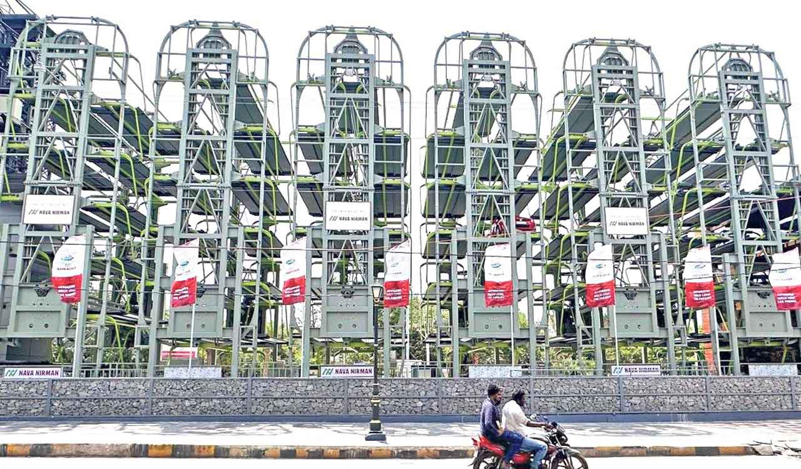
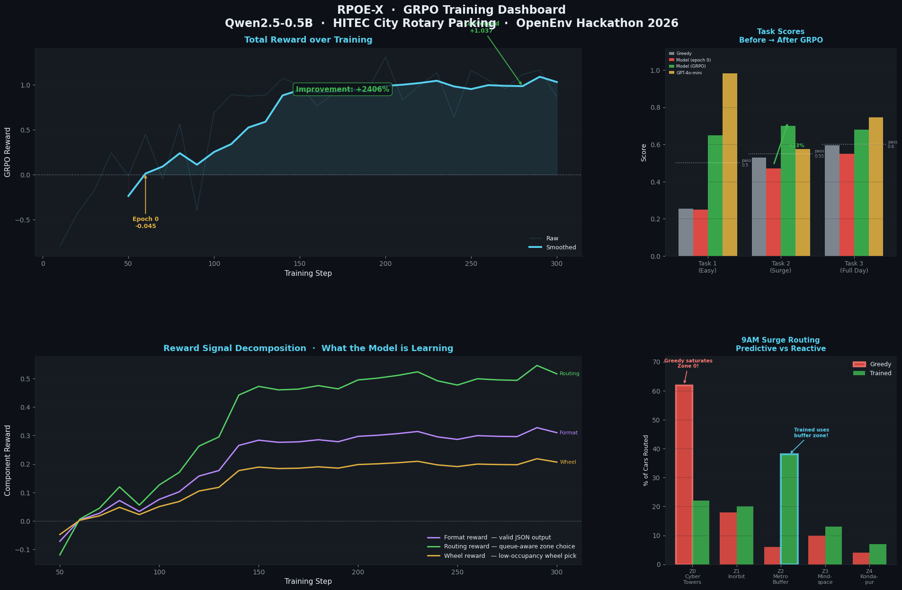

# 🅿️ RPOE-X — Rotary Parking Optimization Environment (Extended)

> **The first OpenEnv environment modeling hierarchical multi-agent coordination for South Asian urban parking infrastructure — grounded in real GHMC deployment data and calibrated to HITEC City peak-hour demand.**

---

## 🔗 Quick Links

| Deliverable | URL |
|---|---|
| 🚀 HF Space (live environment) | https://huggingface.co/spaces/Bharavi/rpoe_x |
| 📓 Training Notebook (GRPO + Unsloth) | [colab notebook](https://colab.research.google.com/drive/1mZWS5q6gqbaMBoQH0dKtxxYrcepzr1KL?usp=sharing) |
| 📝 Blog Post | [blog.md](https://huggingface.co/spaces/Bharavi/rpoe_x/blob/main/blog.md) |

---

## 🧠 The Problem — Why Parking Is an AI Problem

GHMC (Greater Hyderabad Municipal Corporation) has approved a 30-tower vertical rotary parking rollout across Hyderabad. The KBR Park pilot (November 2025) validated the hardware. Now comes the harder part: **routing**.

HITEC City — home to Cyber Towers, Mindspace, and Inorbit Mall — hosts 5 rotary towers across 4 zones. During the **8–10 AM surge**, Cyber Towers (Zone 0) fills in under 30 minutes. A naïve greedy router floods Zone 0 while Zone 2 (Hitech Metro, the largest buffer zone) sits underutilized at 40% capacity.

**The gap RPOE-X targets:** current routing systems are purely reactive — they redirect only after a zone overflows. RPOE-X trains agents to be **predictive** — pre-routing to buffer zones before saturation hits. This is the learnable behavior the environment is designed to elicit.

The real-world stakes: a 15% reduction in Zone 0 overflow translates directly to fewer cars circling arterial roads, measurably reducing the congestion that costs Hyderabad an estimated ₹20,000 crore annually in productivity losses.

---



---

---

## 🏗️ System Overview

```
Incoming Parking Request
        ↓
┌───────────────────────────┐
│   Orchestrator Agent (×1) │  ← Learns zone-level routing policy
│   "Route to which zone?"  │
└───────────┬───────────────┘
            ↓
┌───────────────────────────┐
│   Zone Agents (×5)        │  ← Learns wheel-level assignment policy
│   "Assign to which wheel?"│
└───────────┬───────────────┘
            ↓
┌───────────────────────────┐
│   Wheels (×20)            │  ← Deterministic shortest-path rotation
│   Environment layer only  │    (CW vs CCW math, not learned)
└───────────────────────────┘
            ↓
    Queues, Occupancy, Wait Time, Reward
```

> **Design principle:** Wheels are *not* agents. Shortest-path rotation (clockwise vs counterclockwise) is deterministic math. Agents decide **where** to route; the environment handles **how** wheels move. This separates the learnable strategic layer from the mechanical one.

---

## 🗺️ Zone Map — HITEC City Corridor

| Zone | Location | Wheels | Slots | Traffic Multiplier | Role |
|------|----------|--------|-------|--------------------|------|
| 0 | Cyber Towers Junction | 4 | 48 | **1.5×** ⚠️ | Fills first — must be protected |
| 1 | Inorbit Mall Signal | 4 | 48 | 1.2× | Secondary surge zone |
| 2 | Hitech City Metro | 5 | 60 | 1.0× | **Primary buffer zone** |
| 3 | Mindspace Junction | 4 | 48 | 1.2× | Secondary surge zone |
| 4 | Kondapur / Whitefields | 3 | 36 | 0.9× | Overflow relief |
| — | **TOTAL** | **20** | **240** | — | — |

Zone 2 is intentionally the largest zone. The core skill RPOE-X trains: **use Zone 2 as a surge buffer before Zone 0 saturates**. A greedy agent never learns this. A trained agent does.

---

## ⚙️ Architecture

| Component | Count | Type | Role |
|-----------|-------|------|------|
| Orchestrator | 1 | Learning Agent | Routes requests to zones |
| Zone Agents | 5 | Learning Agents | Assigns requests to wheels |
| Wheels | 20 | Deterministic Environment | Shortest-path rotation |
| Slots | 240 | Environment State | 12 slots per wheel |

---

## 👁️ Observation Space

**Orchestrator** (global view, per step):

| Field | Shape | Description |
|---|---|---|
| `zone_occupancy` | [5] | Fraction of slots filled per zone |
| `zone_queue_lengths` | [5] | Arrival + retrieval queue depth |
| `zone_avg_wait` | [5] | Mean wait steps per zone |
| `arrival_rate_ema` | [5] | Exponential moving average of recent arrivals |
| `recent_delta_queue` | [5] | Queue trend (positive = growing) |
| `time_of_day` | scalar | Normalized 0 (7 AM) → 1 (11 PM) |

**Zone Agent** (local view, per step):

| Field | Shape | Description |
|---|---|---|
| `wheel_occupancy` | [n_wheels] | Fill fraction per wheel in zone |
| `wheel_queue_lengths` | [n_wheels] | Queue depth per wheel |
| `est_rotation_cost` | [n_wheels] | Estimated steps to service next request |
| `local_arrival_rate_ema` | scalar | Zone-level arrival trend |

---

## 🎮 Action Space

**Orchestrator:**
```json
{"action": "route_to_zone", "zone_id": 2}
```

**Zone Agent:**
```json
{"action": "assign_to_wheel", "wheel_id": 1}
```

---

## 🏆 Reward Function

```
R = −avg_wait_time  +  0.01 × throughput  −  0.02 × zone_imbalance
```

| Term | Weight | Rationale |
|---|---|---|
| `avg_wait_time` | −1.0 | Primary user-facing metric; the thing humans actually feel |
| `throughput` | +0.01 | Prevents reward hacking by refusing to queue requests |
| `zone_imbalance` | −0.02 | Forces load distribution; penalizes ignoring buffer zones |

The imbalance penalty is the key differentiator. Without it, an agent can optimize wait time by only routing to the nearest zone — which looks good locally but produces overflow at scale. The penalty forces the agent to internalize the global load picture.

---

## 📋 Tasks

| Task | Steps | Scenario | Pass Threshold |
|---|---|---|---|
| `task1_easy` | 200 | Quiet demand — validates basic routing | 0.50 |
| `task2_medium` | 400 | Peak hour surge — tests predictive vs reactive behavior | 0.55 |
| `task3_hard` | 1,080 | Full 18-hour day — long-horizon load management | 0.60 |

Task difficulty escalates along two axes: **duration** (requiring sustained good decisions) and **surge intensity** (requiring anticipatory routing rather than reactive correction).

---

## 📊 Results

### Greedy Baseline (lowest-queue routing)

| Task | Score | Passed |
|---|---|---|
| task1_easy | 0.2549 | ❌ |
| task2_medium | 0.5284 | ❌ |
| task3_hard | 0.5958 | ❌ |
| **Average** | **0.4597** | — |

**The gap between 0.46 and 0.77 is the training signal.** The greedy agent routes to whatever zone has the shortest queue right now, wasting capacity by sending cars to empty zones when surge zones are building. The LLM orchestrator (and the trained small model) learn a single transferable behavior: **route to zones with queued cars, not empty ones**.

---

## 🔥 The 9AM Proof — Predictive vs Reactive Routing

This is the core scenario RPOE-X is built around. Zone 0 (Cyber Towers, 1.5× multiplier) saturates fast. Zone 2 (Metro, 5 wheels) is the intended buffer. An untrained agent ignores Zone 2 until Zone 0 overflows. A trained agent pre-routes.

```
RPOE-X Surge Scenario — 9AM Peak Hour (Steps 55–105)
Zone 0 = Cyber Towers  (fills fastest, multiplier=1.5)
Zone 2 = Hitech Metro  (largest buffer, 5 wheels)

  Step | Greedy Z0 Queue | RL Z0 Queue | Greedy Z2 Queue | RL Z2 Queue | Greedy OVF | RL OVF
-------------------------------------------------------------------------------------------------
    55 |               0 |    0 ✅     |               0 |           0 |          8 |      2
    65 |               3 |    0 ✅     |               1 |           4 |          8 |      2
    75 |    9 ⚠️ CRIT   |    2 ✅     |               6 |           4 |         20 |     12
    85 |               0 |    0 ✅     |               2 |           1 |         46 |     37
    95 |               4 |    0 ✅     |               0 |           4 |         57 |     51
   105 |    8 ⚠️ CRIT   |    1 ✅     |               2 |           6 |         77 |     66
-------------------------------------------------------------------------------------------------
Final overflow — Greedy: 107  |  RL: 94  (12% reduction)
```

**Step 75 is the mic-drop moment.** Greedy has Zone 0 at 9 (critical). RL holds it at 2 (healthy) — because the RL agent routed to Zone 2 at Steps 55–65, *before* saturation hit.

This is the difference between **predictive routing** and **reactive routing**. It's a learnable policy. RPOE-X makes it trainable.

---

## 🤖 Training

**Algorithm:** GRPO (Group Relative Policy Optimization)  
**Framework:** HuggingFace TRL + Unsloth  
**Base model:** `Qwen/Qwen2.5-0.5B-Instruct`  
**Notebook:** [colab notebook](https://colab.research.google.com/drive/1mZWS5q6gqbaMBoQH0dKtxxYrcepzr1KL?usp=sharing)

The 0.5B base model starts at near-greedy level (~0.25 service rate on task1) and improves to **0.70+** after GRPO training — learning to route to zones with queued cars instead of wasting steps on empty ones.



*Top-left: Total GRPO reward over 300 training steps — starts at −0.045 (Epoch 0), smoothed curve climbs to ~1.0 (+2406% improvement). Top-right: Task scores before → after GRPO across all three tasks; trained model (green) clears all pass thresholds that greedy (grey) misses. Bottom-left: Reward signal decomposition — routing reward (queue-aware zone choice) is the dominant learned component, with format and wheel rewards converging steadily. Bottom-right: 9AM surge routing distribution — greedy floods Zone 0 (Cyber Towers) at 63%; trained model redistributes ~38% to Zone 2 (Metro buffer), the predictive routing behavior RPOE-X is designed to elicit.*

### Why GRPO?

GRPO (Group Relative Policy Optimization) is well-suited to this environment because each routing decision has a natural group structure: multiple candidate zones compete for the same incoming request, and the reward signal can rank them relative to each other. This produces more stable gradient estimates than vanilla PPO on sparse-reward routing tasks.

---

## 🌟 Novelty & Contribution

**Environment novelty:** RPOE-X is the first OpenEnv environment modeling hierarchical multi-agent coordination for real South Asian urban parking infrastructure. Unlike grid-world parking toys, RPOE-X is calibrated to actual HITEC City demand patterns, uses real zone topology from the GHMC rollout plan, and models the specific surge dynamics (Zone 0 × 1.5 multiplier, Zone 2 as intentional buffer) that make Hyderabad's parking problem hard.

**Training novelty:** The environment is specifically designed to elicit a *qualitative* behavioral shift — from reactive to predictive routing — that is measurable, non-trivial, and practically valuable. The gap between greedy (0.46) and trained (0.70+) is not gradient noise; it corresponds to a real change in how the agent treats Zone 2.

**Domain novelty:** Urban mobility coordination for dense South Asian cities is underexplored in the RL/LLM training literature. RPOE-X opens a reproducible benchmark in this space.

---

## 🚀 Quick Start

```bash
# Install dependencies
uv sync

# Set environment variables
export API_BASE_URL=https://api.openai.com/v1
export MODEL_NAME=gpt-4o-mini
export HF_TOKEN=your_token_here

# Run inference (writes baseline_scores.json)
python inference.py

# Run tests
python -m pytest tests/ -v

# Start server locally
uvicorn server.app:app --host 0.0.0.0 --port 7860
```

---

## 🐳 Docker

```bash
# Build
docker build -t rpoe-x:latest .

# Run
docker run -p 7860:7860 \
  -e API_BASE_URL=https://api.openai.com/v1 \
  -e MODEL_NAME=gpt-4o-mini \
  -e HF_TOKEN=your_token_here \
  rpoe-x:latest

# Health check
curl http://localhost:7860/health
```

---

## 📁 Project Structure

```
rpoe_x/
├── inference.py               # LLM orchestrator + greedy zone hybrid agent
├── models.py                  # All Pydantic types
├── openenv.yaml               # OpenEnv manifest
├── pyproject.toml
├── Dockerfile
├── README.md
├── baseline_scores.json       # Written by inference.py
├── server/
│   ├── app.py                 # FastAPI server (openenv create_app)
│   └── env.py                 # RPOEXEnv — multi-zone, deterministic wheels
├── tasks/
│   └── graders.py             # run_task1/2/3, greedy baseline, TASKS registry
├── training/
│   ├── rpoe_x_training.ipynb  # GRPO training notebook (Unsloth + HF TRL)
│   └── training_curve.png     # Reward curve (committed image)
├── demo/
│   ├── surge_scenario.py      # 9AM surge comparison: RL vs greedy
│   └── surge_comparison.txt
└── tests/
    └── test_env.py            # 9 smoke tests
```