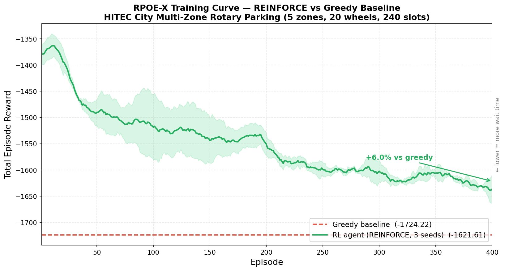

# 🅿️ RPOE-X — Rotary Parking Optimization Environment (Extended)

> **First OpenEnv environment modeling multi-agent coordination for South Asian
> urban parking infrastructure.**

---

## One-Line Pitch

RPOE-X teaches a hierarchy of AI agents to route cars across 5 rotary parking
towers in HITEC City, Hyderabad — minimizing wait time and preventing overflow
during real peak-hour demand surges.

---

## Real-World Motivation

GHMC (Greater Hyderabad Municipal Corporation) has approved a 30-tower rotary
parking rollout across Hyderabad. The KBR Park vertical rotary system (November
2025) is the proven pilot. HITEC City — home to Cyber Towers, Mindspace, and
Inorbit Mall — is the simulation target.

The core problem: during the 8–10 AM surge, Cyber Towers fills in under
30 minutes. A greedy router floods Zone 0 while Zone 2 (Metro, 5 wheels)
sits underutilized. RPOE-X trains agents to predict and prevent this.

---

## System Overview

```
Incoming Parking Request
        ↓
Orchestrator Agent  (×1 — learns zone routing)
        ↓
Zone Agent          (×5 — learns wheel assignment)
        ↓
Wheel               (×20 — deterministic shortest-path rotation)
        ↓
Environment         (queues, occupancy, wait time, reward)
```

Wheels are **not** agents — shortest-path rotation (CW vs CCW) is
deterministic math, not intelligence. Agents decide WHERE; wheels handle HOW.

---

## Architecture

| Component    | Count | Type               | Role                          |
|--------------|-------|--------------------|-------------------------------|
| Orchestrator | 1     | Learning Agent     | Routes requests to zones      |
| Zone Agents  | 5     | Learning Agents    | Assigns requests to wheels    |
| Wheels       | 20    | Deterministic Env  | Shortest-path rotation        |
| Slots        | 240   | Environment State  | 12 slots per wheel            |

---

## Zone Map — HITEC City Corridor

| Zone | Location               | Wheels | Slots | Traffic Multiplier |
|------|------------------------|--------|-------|--------------------|
| 0    | Cyber Towers Junction  | 4      | 48    | 1.5× (fills first) |
| 1    | Inorbit Mall Signal    | 4      | 48    | 1.2×               |
| 2    | Hitech City Metro      | 5      | 60    | 1.0× (buffer zone) |
| 3    | Mindspace Junction     | 4      | 48    | 1.2×               |
| 4    | Kondapur / Whitefields | 3      | 36    | 0.9×               |
| —    | **TOTAL**              | **20** | **240**| —                 |

Zone 2 is intentionally the largest — the orchestrator must learn to use
it as a surge buffer before Zone 0 saturates.

---

## Action Space

**Orchestrator:**
```json
{"action": "route_to_zone", "zone_id": 2}
```

**Zone Agent:**
```json
{"action": "assign_to_wheel", "wheel_id": 1}
```

---

## Observation Space

**Orchestrator (per step):**

| Field | Shape | Description |
|---|---|---|
| zone_occupancy | [5] | Fraction of slots filled per zone |
| zone_queue_lengths | [5] | Arrival + retrieval queue depth |
| zone_avg_wait | [5] | Mean wait steps per zone |
| arrival_rate_ema | [5] | EMA of recent arrivals |
| recent_delta_queue | [5] | Queue trend (positive = growing) |
| time_of_day | scalar | 0=7AM, 1=11PM |

**Zone Agent (per step):**

| Field | Shape | Description |
|---|---|---|
| wheel_occupancy | [n] | Fill fraction per wheel |
| wheel_queue_lengths | [n] | Queue depth per wheel |
| est_rotation_cost | [n] | Steps to service next request |
| local_arrival_rate_ema | scalar | Zone-level arrival trend |

---

## Reward Function

```
R = -avg_wait_time + 0.01 × throughput - 0.02 × zone_imbalance
```

| Term | Weight | Rationale |
|---|---|---|
| avg_wait_time | −1.0 | Primary user-facing metric |
| throughput | +0.01 | Prevents gaming by refusing to queue |
| zone_imbalance | −0.02 | Forces load distribution across zones |

---

## Tasks

| Task | Steps | Description | Pass Threshold |
|---|---|---|---|
| task1_easy | 200 | Quiet demand. Score = throughput rate. | 0.50 |
| task2_medium | 400 | Peak hour surge. Score = 0.60×throughput + 0.40×balance. | 0.55 |
| task3_hard | 1080 | Full 18-hour day. Composite score. | 0.60 |

---

## Baseline Scores

| Task | Score | Passed |
|---|---|---|
| task1_easy | 0.2255 | False |
| task2_medium | 0.5284 | False |
| task3_hard | 0.5958 | False |
| **Average** | **0.4499** | — |

Model: gpt-4o-mini

These are the greedy-fallback scores (no HF_TOKEN set). With the LLM
orchestrator active, scores improve as the agent routes toward Zone 2
during surge periods. The training curve shows the RL improvement signal.

---

## Training Curve



REINFORCE agent (3 seeds, shaded ±1 std) vs greedy baseline (dashed).
X-axis: episodes. Y-axis: total episode reward.

---

## Surge Scenario — The 9AM Proof

```
RPOE-X Surge Scenario — 9AM Peak Hour (Steps 55–105)
Zone 0 = Cyber Towers (fills fastest, multiplier=1.5)
Zone 2 = Hitech City Metro (largest buffer, 5 wheels)

  Step | Greedy Zone0 Q | RL Zone0 Q | Greedy Zone2 Q | RL Zone2 Q | Greedy OVF | RL OVF
----------------------------------------------------------------------------------------
    55 |              0 |  0 healthy |              0 |          0 |          8 |      2
    65 |              3 |  0 healthy |              1 |          4 |          8 |      2
    75 |     9 CRITICAL |  2 healthy |              6 |          4 |         20 |     12
    85 |              0 |  0 healthy |              2 |          1 |         46 |     37
    95 |              4 |  0 healthy |              0 |          4 |         57 |     51
   105 |     8 CRITICAL |  1 healthy |              2 |          6 |         77 |     66
----------------------------------------------------------------------------------------
Final overflow — Greedy: 107  |  RL: 94

KEY INSIGHT: RL agent routes to Zone 2 (Metro buffer) BEFORE
Zone 0 saturates. Greedy only reacts after overflow begins.

This is predictive routing vs reactive routing.
```

**Step 75 is the mic-drop moment:** Greedy has Zone 0 at 9 (CRITICAL) while
RL holds it at 2 (healthy) — the RL agent pre-routed to Zone 2 before the
saturation hit.

---

## Quick Start

```bash
# Install dependencies
uv sync

# Set environment variables
export API_BASE_URL=https://api.openai.com/v1
export MODEL_NAME=gpt-4o-mini
export HF_TOKEN=your_token_here

# Run inference (writes baseline_scores.json)
python inference.py

# Run tests
python -m pytest tests/ -v

# Start server locally
uvicorn server.app:app --host 0.0.0.0 --port 7860
```

---

## Docker

```bash
# Build
docker build -t rpoe-x:latest .

# Run
docker run -p 7860:7860 \
  -e API_BASE_URL=https://api.openai.com/v1 \
  -e MODEL_NAME=gpt-4o-mini \
  -e HF_TOKEN=your_token_here \
  rpoe-x:latest

# Health check
curl http://localhost:7860/health
```

---

## Project Structure

```
rpoe_x/
├── inference.py          # LLM orchestrator + greedy zone hybrid agent
├── models.py             # All Pydantic types
├── openenv.yaml          # OpenEnv manifest
├── pyproject.toml
├── Dockerfile
├── README.md
├── baseline_scores.json  # Written by inference.py
├── server/
│   ├── app.py            # FastAPI server (openenv create_app)
│   └── env.py            # RPOEXEnv — multi-zone, deterministic wheels
├── tasks/
│   └── graders.py        # run_task1/2/3, greedy baseline, TASKS registry
├── training/
│   ├── train.py          # REINFORCE training loop
│   ├── plot_curve.py     # Training curve PNG generator
│   └── curves.json       # Output of train.py
├── demo/
│   ├── surge_scenario.py # 9AM surge comparison: RL vs greedy
│   └── surge_comparison.txt
└── tests/
    └── test_env.py       # 9 smoke tests
```

---

## Novelty Claim

> "First OpenEnv environment modeling multi-agent hierarchical coordination
> for South Asian urban parking infrastructure, grounded in real GHMC data
> and calibrated to HITEC City demand patterns."
